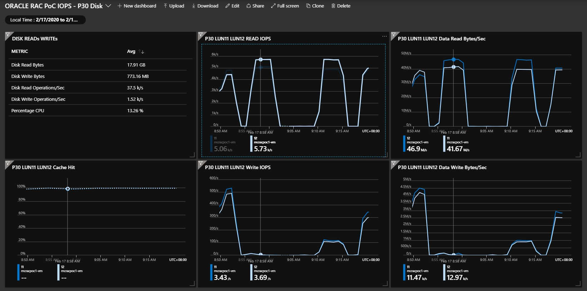

**Original Deployment:**

    OS Size:
        --------------------------------------------------------------------------------------------------------      
        Name             Deployment 1               Deployment 2 
        --------------------------------------------------------------------------------------------------------  
        mcracpoc1        Standard D8s               Standard M64s 
        mcracpoc2        Standard D8s               Standard M64s 
        mcracpocq        Standard DS2               Standard M8*
        --------------------------------------------------------------------------------------------------------  
        * Manually move quorum node in Deployment 2 to another availability set and reset to D4s cost saving.

    OS disk
        --------------------------------------------------------------------------------------------------------
        Name                Size        Storage account type        Encryption        Host caching
        --------------------------------------------------------------------------------------------------------
        mcracpoc1           32 GiB      Premium SSD                 Not enabled       Read-only
        mcracpoc2           32 GiB      Premium SSD                 Not enabled       Read-only
        mcracpocq           32 GiB      Premium SSD                 Not enabled       Read-only
        --------------------------------------------------------------------------------------------------------

    Deployment 1 ASM DG:
        ---------------------------------------------------------------------------------------------------------
        GroupName  Status  Mounted   Type    TotalMiB  FreeMiB   ReadLocal  Vote    Disks
        ---------------------------------------------------------------------------------------------------------
        DATA       Good    AllNodes  NORMAL  2097152   318848    Enabled    None    P30 x 1 x 2 nodes
        FRA        Good    AllNodes  NORMAL  3145728   2816960   Enabled    None    P20 x 3 x 2 nodes
        GRID       Good    AllNodes  NORMAL  10240     9336      Enabled    3/3     P2  x 1 x 2 nodes
        P60        Good    AllNodes  NORMAL  16777216  12398088  Enabled    None    P60 x 1 x 2 nodes
        P60S       Good    AllNodes  NORMAL  16777216  12398008  Enabled    None    P30 x 8 x 2 nodes
        P80        Good    AllNodes  NORMAL  67106816  62727408  Enabled    None    P80 x 1 x 2 nodes
        ---------------------------------------------------------------------------------------------------------
        * P60S means use P30 Disk to create same capacity as one P60 (striped)

    Deployment 2 ASM DG:
        ---------------------------------------------------------------------------------------------------------
        GroupName  Status  Mounted   Type    TotalMiB  FreeMiB   ReadLocal  Vote    Disks
        ---------------------------------------------------------------------------------------------------------
        FRA        Good    AllNodes  NORMAL  3145728   2735592   Enabled    None    P20 x 3  x 2 nodes
        GRID       Good    AllNodes  NORMAL  10240     9328      Enabled    3/3     P2  x 3  x 2 nodes
        P30S       Good    AllNodes  NORMAL  33554432  16603288  Enabled    None    P30 x 16 x 2 nodes
        P60S       Good    AllNodes  NORMAL  67108864  50162560  Enabled    None    P60 x 4  x 2 nodes
        P60SFRA    Good    AllNodes  NORMAL  2097152   1687104   Enabled    None    P30 x 1  x 2 nodes
        ---------------------------------------------------------------------------------------------------------

    **NOTE:**
        - Azure only enable Read-Only disk cache for disk less than 4TB. FlashGrid only support disks with READ-ONLY cache.
        - P60 & P80 disks are added manually to ASM after cluster deployed. 
        - FlashGrid reported OS issue when using NONE Caching disk for large IOPS. Did not experience this problem during Stress test.
        - Use NONE cached disk is not recommended/supported by FlashGrid for the time being (Feb 2020)
  
**Create Oracle DB**

    Deployment 1 Test DB:
        -----------------------------------------------------------------------------------------------------------
        DBName      Block   TabaleSpace         DG          BIGFILE     SYSTEM      SYSAUX      FRA DG      REDO
        -----------------------------------------------------------------------------------------------------------
        P30DB       8KB     IOPS                DATA         800GiB     24GiB       24GiB       256GiB      10GiB*4
        P60DB       8KB     IOPS                P60         2048GiB     24GiB       24GiB       256GiB      10GiB*4
        P80DB       8KB     IOPS                P80         2048GiB     24GiB       24GiB       256GiB      10GiB*4
        P60SDB      8KB     IOPS                P60S        2048GiB     24GiB       24GiB       256GiB      10GiB*4
        -----------------------------------------------------------------------------------------------------------
    
    Deployment 2 Test DB:
        -----------------------------------------------------------------------------------------------------------
        DBName      Block   TabaleSpace         DG          BIGFILE     SYSTEM      SYSAUX      FRA DG      REDO
        -----------------------------------------------------------------------------------------------------------
        P30SDB       8KB     IOPS                P30S       8192GiB     24GiB       24GiB       768GiB      50GiB*4
        P60SDB       8KB     IOPS                P60S       8192GiB     24GiB       24GiB       768GiB      50GiB*4
        -----------------------------------------------------------------------------------------------------------

    **NOTE: **
        - Resize SYSTEM/SYSAUX to 24GB prevent SLOB load failure. Authough it set to AUTO EXTEND, table space still used up which cause slob load failure 
        - Set REDO logs to a dedicate Disk Group (FRA) to avoid any IO impact on Database DG. 
        - Create Bigfile Tablespace named IOPS. It takes hours to complete when the size reaches TB level. Sample for sizing 8TB tablespace as below.

 **SLOB Test**

    1. Test P-SSD without cache enabled. Not a suggested comfiguration. just to understand the disk latency without cache. 
    2. None Cache IO test result is consistant with different VM size. Normal DB File sequencial read complete in 2-4ms.  
    3. Stress IO with different schema and work unit but keep thread number 1 to reduce parallel IO opertion contension. 
    4. Monitor the IO load with Azure Monitor Metrics and IOState.

**AWR report**

    For each individual AWR report saved in IOStress folder, saved in IOStress folder. Name conversion as following: 

        awr_p30x2_d8s_s64_t1_wu64
        |   |     |   |   |  |--------------Work Unit - 64
        |   |     |   |   |-----------------1 thread per schema
        |   |     |   |---------------------load 64 Schema
        |   |     |-------------------------VM Size - D8s
        |   |-------------------------------2 P30 disk in DG
        |-----------------------------------AWR Report Tag     

**Metrics**
Deployment 1: 
- Test with Ds Es vms. This round of test focus on single disk performance with small active set (100Gb)
* For E series VM test, use various SLOB parameter to stress IO to 80-90% utilization except marked with *. This is a smaple data for 50% utilization from comparasion.

| VM Size | Max_IOPS | DISK | IOPS | QTR | RAC_IOPS  | CACHE | IOPS_RESULT |DB_S_R_WAIT |<32us|<64us|<128us|<256us|<512us|<1ms|<2ms|<4ms|<8ms|<16ms|<32ms|<64ms|<128ms|
| ----    |--------- |----  |----  |---- |---------  | ----  | ----------- |----------- |---- |---- |----  |----  |----  |----|----|----|----|---- |---- |---- |----  |
| E32v3   | 51K/64K  |P30   |  5K  |  2  |  10K      | NONE  |  8039       |  4.2M      |-    |-    |-     |-     |-     |-   |-   |73.1|20.9|2.8  |2.4  |0.8  |0.0   |
| E32v3   | 51K/64K  |P30   |  5K  |  2  |  10K      | READ  |  9215       |  4.8M      |-    |-    |-     |0.3   |13.2  |3.7 |0.6 |64.5|12.9|1.9  |2.1  |0.9  |0.0   |
| E32v3   | 51K/64K  |P30   |  5K  | 16  |  80K      | NONE  |   61K       |  6.2M      |-    |-    |-     |-     |-     |-   |-   |73.2|18.1|3.7  |3.8  |1.1  |0.0   |
| E32v3   | 51K/64K  |P30   |  5K  | 16  |  80K      | READ  |   44K*      |  4.4M      |-    |-    |-     |0.3   |8.8   |3.9 |1.5 |61.8|19.8|2.1  |1.4  |0.4  |0.0   |
| E32v3   | 51K/64K  |P60   | 16K  |  2  |  32K      | NONE  |   25K       | 13.3M      |-    |-    |-     |-     |-     |-   |-   |90.1|4.9 |2.5  |2.2  |0.3  |0.0   |
| E32v3   | 51K/64K  |P80   | 20K  |  2  |  40K      | NONE  |   33K       |  5.5M      |-    |-    |-     |-     |-     |-   |-   |60.5|23.4|4.5  |9.4  |2.2  |0.0   |

* For M series VM test, skip the none cached disk performance as it is not the recommend solution. But anyway, did one quick test. 97% DB file sequencial read completed in 2-4ms. Similar result as E32 system. For M series test, focus on large active data set and Write Accelerate.

- For M series, Accelerate Writer is suggested to enable on REDO log disk, not DB data disk. 

Test 1: DB Node Host Cache (1024GiB x 2 Nodes) > 65GiB Active Dataset > 3GiB SGA

| VM Size | Max_IOPS | DISK | IOPS | QTR | RAC_IOPS  | CACHE | IOPS_RESULT |DB_S_R_WAIT |<32us|<64us|<128us|<256us|<512us|<1ms|<2ms|<4ms|<8ms|<16ms|<32ms|<64ms|<128ms|
| ----    |--------- |----  |----  |---- |---------  | ----  | ----------- |----------- |---- |---- |----  |----  |----  |----|----|----|----|---- |---- |---- |----  |
| M64     | 40K/80K  |P30   |  5K  | 32  | 160K      | READ  |  125K       | 39.8M      |-    |-    |-     |4.2   |48.8  |28.6|11.4|4.1 |0.8 |2.0  |0.1  |0.0  |0.0   |
| M64     | 40K/80K  |P30   |  5K  | 32  | 160K      | R-WA  |  107K       | 33.8M      |-    |-    | 2.2  |50.7  |37.0  |4.7 |1.0 |4.0 |0.4 |0.0  |0.0  |0.0  |0.0   |
| M128    | 80K/160K |P60   | 16K  |  8  | 128K      | NONE  |             |            |0.0  |0.0  | 0.0  |0.0   |0.0   |0.0 |0.0 |0.0 |0.0 |0.0  |0.0  |0.0  |0.0   |
| M128    | 80K/160K |P60   | 16K  |  8  | 128K      | N-WA  |             |            |0.0  |0.0  | 0.0  |0.0   |0.0   |0.0 |0.0 |0.0 |0.0 |0.0  |0.0  |0.0  |0.0   |

- Each stress lasted for 5min. During stress period, IOPS for each disk stable at 5K.
- Over 50% completed less than 512us. less than 20% over 2ms.
- Write Accelarate make it even better. 50% less than 256us, 95% completed in 1ms. 

Test 2: DB Node Host Cache (1024GiB x 2 Nodes) = 2048GiB Active Dataset (SCALE=2GiB, SCHEMA_NUM = 1024) > 40GiB SGA

| VM Size | Max_IOPS | DISK | IOPS | QTR | RAC_IOPS  | CACHE | IOPS_RESULT |DB_S_R_WAIT |<32us|<64us|<128us|<256us|<512us|<1ms|<2ms|<4ms|<8ms|<16ms|<32ms|<64ms|<128ms|
| ----    |--------- |----  |----  |---- |---------  | ----  | ----------- |----------- |---- |---- |----  |----  |----  |----|----|----|----|---- |---- |---- |----  |
| M64     | 40K/80K  |P30   |  5K  | 32  | 160K      | READ  |             |            |-    |-    |-     |4.2   |48.8  |28.6|11.4|4.1 |0.8 |2.0  |0.1  |0.0  |0.0   |
| M64     | 40K/80K  |P30   |  5K  | 32  | 160K      | R-WA  |             |            |-    |-    | 2.2  |50.7  |37.0  |4.7 |1.0 |4.0 |0.4 |0.0  |0.0  |0.0  |0.0   |
| M128    | 80K/160K |P60   | 16K  |  8  | 128K      | NONE  |             |            |0.0  |0.0  | 0.0  |0.0   |0.0   |0.0 |0.0 |0.0 |0.0 |0.0  |0.0  |0.0  |0.0   |
| M128    | 80K/160K |P60   | 16K  |  8  | 128K      | N-WA  |             |            |0.0  |0.0  | 0.0  |0.0   |0.0   |0.0 |0.0 |0.0 |0.0 |0.0  |0.0  |0.0  |0.0   |

Test 3: 2048GiB Active Dataset (SCALE=4GiB, SCHEMA_NUM = 768) > DB Node Host Cache (1024GiB x 2 Nodes) > 40GiB SGA

1. FlashGrid SkyCluster is able to provide a RAC environment on cloud with high IO throughput.
2. We can put the Premium Data Disk IOPS to its limitation without impact Oracle OS Stability
3. Disk with READ-ONLY CACHE is helpful to improve the IO performance. Be careful to choose the Disk & VM size.
4. Use disks under 4T can be a good option if it can provide enough capacity. 
5. As VM Cached IO throughput limitation is much higher than the none cached limit, by choosing P-SSD smaller than 4T, we can also choose a small VM size to support high Cached IO throughput. 

